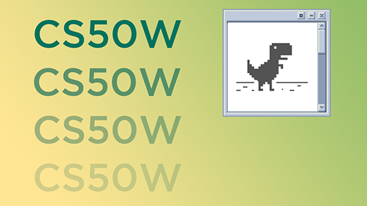

# HARVARD CS50W PROJECTS

 

## This repository stores all the 6 projects I had completed in order to earn the

 

[Harvard CS50W Web development using Python and Javascript course (click to view info)](https://pll.harvard.edu/course/cs50s-web-programming-python-and-javascript) 

 

### <strong> ✅ Verified Certification earned : </strong>
 
> [Click here to view my CS50W Verified certificate](https://courses.edx.org/certificates/1bca14165d054f91b462067024f30454)

 

## 💻 Frameworks and programming languages :

 

## Capstone Project :

