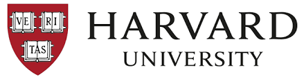

# HARVARD CS50W PROJECTS

 

## This repository stores all the 6 projects I had completed in order to earn the

 

[Harvard CS50W Web development using Python and Javascript course (click to view info)](https://pll.harvard.edu/course/cs50s-web-programming-python-and-javascript) 

 

### <strong> ✅ Verified Certification earned : </strong>
 
> [Click here to view my CS50W Verified certificate](https://courses.edx.org/certificates/1bca14165d054f91b462067024f30454)

 

## 💻 Frameworks and programming languages :

 

## Capstone Project :

[ mathango ](./mathango/)

 

* ### Project 0 : 

[ google search mimic (link)](https://github.com/QuietkidAniket/googlesearchmimic.github.io)

A website that mimics the overall google search page aesthetics and redirects each request to the google server.

* ### Project 1 : 

[ wiki ](./wikiproject/)

Complete the implementation of Wiki encyclopedia. Was useful for learning markdown and how to interpret them and render them as a part of the webpage.

* ### Project 2 : 

[ commerce ](./commerce/)

An eBay-like e-commerce auction site that will allow users to post auction listings, place bids on listings, comment on those listings, and add listings to a “watchlist".

* ### Project 3 : 

[ google search mimic (link)](https://github.com/QuietkidAniket/googlesearchmimic.github.io)

A website that mimics the overall google search page aesthetics and redirects each request to the google server.

* ### Project 4 : 

[ google search mimic (link)](https://github.com/QuietkidAniket/googlesearchmimic.github.io)

A website that mimics the overall google search page aesthetics and redirects each request to the google server.

* ### Project 5 : 

[ google search mimic (link)](https://github.com/QuietkidAniket/googlesearchmimic.github.io)

A website that mimics the overall google search page aesthetics and redirects each request to the google server.

* ### Project 6 : 

[ google search mimic (link)](https://github.com/QuietkidAniket/googlesearchmimic.github.io)

A website that mimics the overall google search page aesthetics and redirects each request to the google server.

